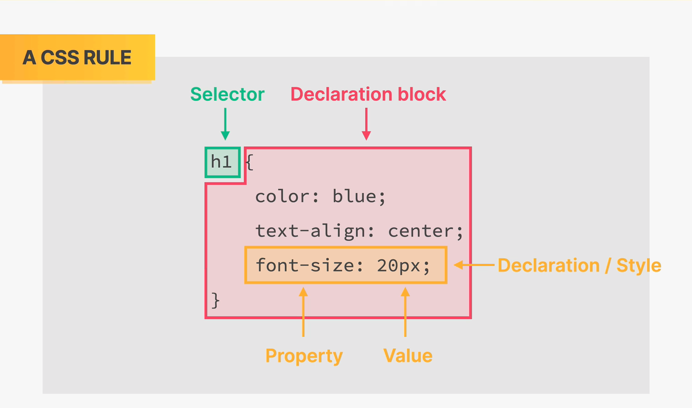
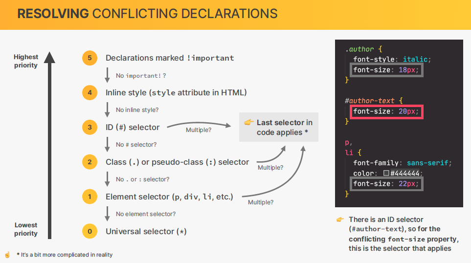
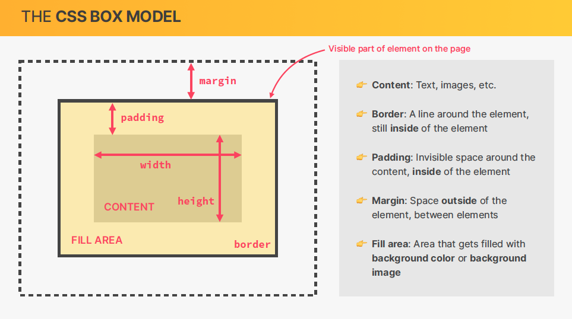
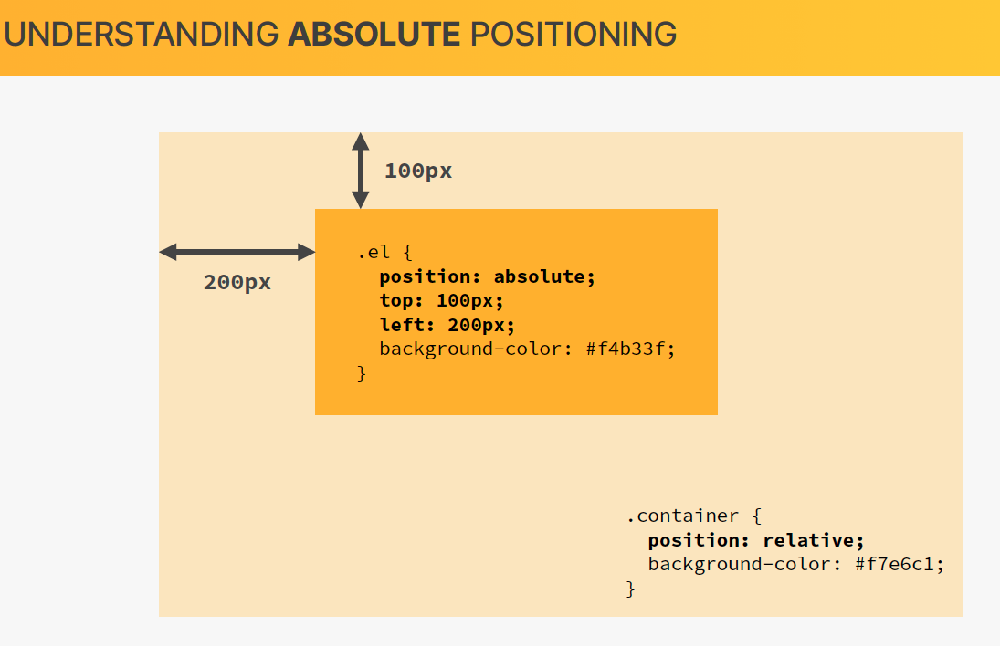
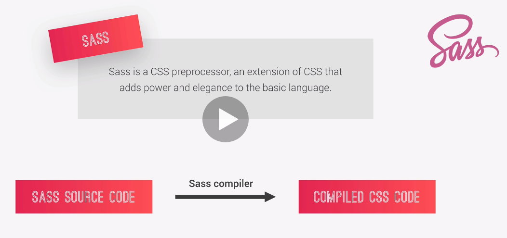
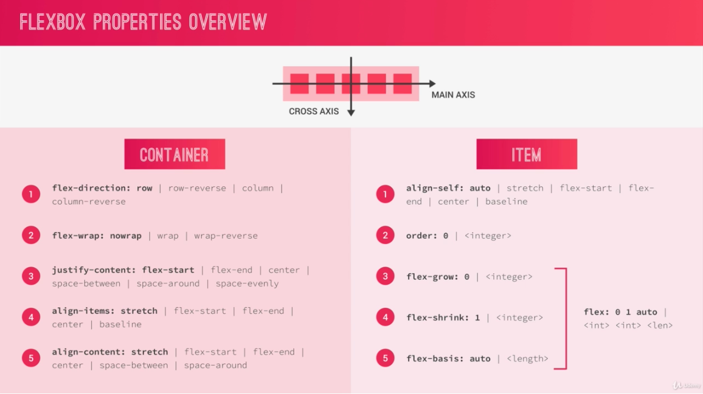

## Advanced CSS and practical tricks

### Why CSS?

Well, it all started with TailwindCSS and Vue. Although they are very good frameworks and libraries, I felt they tend to distance us from the basic concepts of CSS and javascript.
In addition, the more you start develop real applications and go through the whole process of creating and maintaining code, practices such as those embedded in Design Patterns, SOLID principles and CLEAN code becomes very important. Therefore, separation of concerns, makes it easy to expand your code. In this sense, decoupling CSS from HTML, becomes very important. The utility-first tailwindcss seems to be useful for small, quick, apps, but it rapidly becomes cumbersome and impractical to read the code in large chunks of code.
In addition, CSS and javascript has evolved during the years, and knowing how to organize them, provides you freedom from frameworks, which is also a SOLID principle: your code should be framework agnostic.




### The CSS Box Model



### Notes

1. Absolute vs relative position. Normally define parent widget as `relative` and child widgets as `absolute`.
   
2. transform: translate, position it relative to widget itself
3. @keyframe: provides frames per time stamp, from 0 to 1. Here you can define many types of animations.
4. display: block (display elements one after the other, like paragraphs)or inline-block (display elements in the inline direction, like words are displayed in a sentence).
5. [pseudo elements](https://developer.mozilla.org/en-US/docs/Web/CSS/Pseudo-elements).A CSS pseudo-element is a keyword added to a selector that lets you style a specific part of the selected element(s). For example, `::first-line` can be used to change the font of the first line of a paragraph.

```css
/* The first line of every <p> element. */
p::first-line {
  color: blue;
  text-transform: uppercase;
}
```

Pseudo-elements defined by a set of CSS specifications.

6. [pseudo class](https://developer.mozilla.org/en-US/docs/Web/CSS/Pseudo-classes) is a keyword added to a selector that specifies a special state of the selected element(s). For example, `:hover` can be used to change a button's color when the user's pointer hovers over it.

```css
/* Any button over which the user's pointer is hovering */
button:hover {
  color: blue;
}
```

A pseudo-class consists of a `colon (:)` followed by the pseudo-class name (e.g., `:hover`).

Pseudo-classes let you apply a style to an element not only in relation to the content of the document tree, but also in relation to external factors like the history of the navigator (`:visited`, for example), the status of its content (like `:checked` on certain form elements), or the position of the mouse (like `:hover`, which lets you know if the mouse is over an element or not).

In contrast to pseudo-classes, pseudo-elements can be used to style a specific part of an element.

### Sass

CSS on its own can be fun, but stylesheets are getting larger, more complex, and harder to maintain. This is where a preprocessor can help. [Sass](https://sass-lang.com/) lets you use features that don't exist in CSS yet like variables, nesting, mixins, inheritance and other nifty goodies that make writing CSS fun again.

Once you start tinkering with Sass, it will take your preprocessed Sass file and save it as a normal CSS file that you can use in your website.




Sass supports two different syntaxes. Each one can load the other, so it's up to you and your team which one to choose. We are going to use `SCSS` syntax.

#### Notes about Mixins

- In object-oriented programming languages, a `mixin` is a class that contains methods for use by other classes without having to be the parent class of those other classes. How those other classes gain access to the mixin's methods depends on the language. Mixins are sometimes described as being "included" rather than "inherited". Mixins encourage code reuse and can be used to avoid the inheritance ambiguity that multiple inheritance can cause (the "diamond problem"), or to work around lack of support for multiple inheritance in a language. A mixin can also be viewed as an interface with implemented methods. This pattern is an example of enforcing the dependency inversion principle.
- With Sass you can write a repetitive piece of code and inject these code in other element like a variable.

```CSS
@mixin reset-list {
  margin: 0;
  padding: 0;
  list-style: none;
}

@mixin horizontal-list {
  @include reset-list;

  li {
    display: inline-block;
    margin: {
      left: -2px;
      right: 2em;
    }
  }
}

nav ul {
  @include horizontal-list;
}
```

Mixins can also take **arguments**, which allows their behavior to be customized each time they’re called. The arguments are specified in the @mixin rule after the mixin’s name, as a list of variable names surrounded by parentheses. The mixin must then be included with the same number of arguments in the form of `SassScript expressions`. The values of these expression are available within the mixin’s body as the corresponding variables.

```CSS
@mixin rtl($property, $ltr-value, $rtl-value) {
  #{$property}: $ltr-value;

  [dir=rtl] & {
    #{$property}: $rtl-value;
  }
}

.sidebar {
  @include rtl(float, left, right);
}
```

### BEM Methodology

It is a known fact that the right styleguide can significantly increase development speed, debugging, and the implementation of new features in legacy code. Sadly, most CSS codebases are sometimes developed without any structure or naming conventions. This leads to an unmaintainable CSS codebase in the long term.

The BEM approach ensures that everyone who participates in the development of a website works with a single codebase and speaks the same language. Using proper naming will prepare you for the changes in design of the website.

BEM stands for `Block` , `Element`, `Modifier`.

```CSS
/* Block component */
.btn {}

/* Element that depends upon the block */
.btn__price {}

/* Modifier that changes the style of the block */
.btn--orange {}
.btn--big {}
```

In this CSS methodology a block is a top-level abstraction of a new component, for example a button: `.btn { }`. This block should be thought of as a parent. Child items, or elements, can be placed inside and these are denoted by two underscores following the name of the block like `.btn__price { }`. Finally, modifiers can manipulate the block so that we can theme or style that particular component without inflicting changes on a completely unrelated module. This is done by appending two hyphens to the name of the block just like `btn--orange`.

The markup might then look like this:

```html
<a class="btn btn--big btn--orange" href="https://css-tricks.com">
  <span class="btn__price">$9.99</span>
  <span class="btn__text">Subscribe</span>
</a>
```

## FlexBox

The [Flexbox Layout](https://css-tricks.com/snippets/css/a-guide-to-flexbox/) (Flexible Box) module aims at providing a more efficient way to lay out, align and distribute space among items in a container, even when their size is unknown and/or dynamic (thus the word “flex”).

The main idea behind the flex layout is to give the container the ability to alter its items’ width/height (and order) to best fill the available space (mostly to accommodate to all kind of display devices and screen sizes). A flex container expands items to fill available free space or shrinks them to prevent overflow.



**Note:** Flexbox layout is most appropriate to the components of an application, and small-scale layouts, while the Grid layout is intended for larger scale layouts.

<br>
-- credits to [Advanced CSS and Sass: Flexbox, Grid, Animations and More!](https://www.udemy.com/course/advanced-css-and-sass/), by Jonas Schmedtmann.
